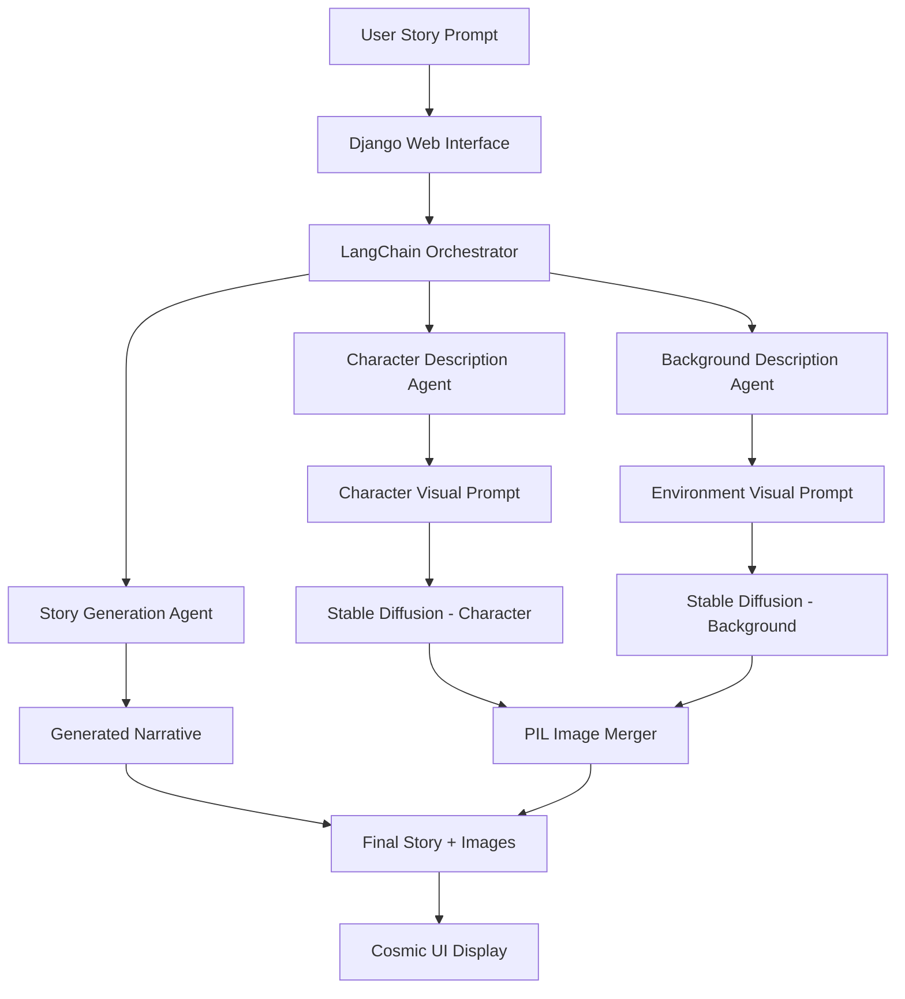

# 🌌 Story Agent - AI-Powered Story Creation Platform

[](YOUR_VIDEO_URL_HERE)
[](https://github.com/SriHarshitha88/story_agent.git)
[](https://www.djangoproject.com/)
[](https://python.langchain.com/)

A sophisticated Django-powered web application that orchestrates multiple AI agents to generate immersive stories with stunning visuals. Combines LangChain's agent architecture, Ollama LLMs, and Stable Diffusion for complete narrative-to-visual pipelines.

## 🌟 Key Features

- 🎭 **Multi-Agent LangChain Architecture**: Orchestrated story, character, and background generation agents
- 🤖 **Advanced Prompt Engineering**: Sophisticated template structures with context chaining
- 🎨 **Integrated Visual Pipeline**: Stable Diffusion + PIL image merging for cohesive scenes  
- 🌌 **Modern Cosmic UI**: Beautiful dark theme with glassmorphism and animations
- ⚡ **Real-time Progress**: Live updates with visual feedback during generation
- 📖 **Narrative Quality**: Coherent, creative stories with character-driven plots
- 🔧 **Production-Ready**: Robust error handling, logging, and scalable architecture

## 🏗️ Multi-Agent Architecture


## 🎬 Demo & Links

### 📺 **Video Demo**
[](https://github.com/user-attachments/assets/39d249a5-5a31-4934-9aa3-adaada0068f8)

## 📋 Prerequisites

1. **Python 3.8+**
2. **Ollama** - Install from [https://ollama.ai/](https://ollama.ai/)
3. **CUDA-compatible GPU** (recommended for image generation)

## 🛠️ Installation

1. **Clone the repository**
```bash
git clone https://github.com/SriHarshitha88/story_agent.git
cd story_agent
```

2. **Create virtual environment**
```bash
python -m venv venv
source venv/bin/activate  # On Windows: venv\Scripts\activate
```

3. **Install dependencies**
```bash
pip install -r requirements.txt
```

4. **Install and setup Ollama**
```bash
# Install Ollama (follow instructions at https://ollama.ai/)
# Pull a language model (e.g., llama2)
ollama pull llama2
```

5. **Configure Django settings**
Edit `story_generator/settings.py` if needed:
```python
OLLAMA_BASE_URL = "http://localhost:11434"
OLLAMA_MODEL = "llama2"  # Change to your preferred model
```

6. **Run migrations**
```bash
python manage.py migrate
```

7. **Create superuser** (optional)
```bash
python manage.py createsuperuser
```

## 🎮 Usage

1. **Start Ollama server**
```bash
ollama serve
```

2. **Start Django development server**
```bash
python manage.py runserver
```

3. **Open your browser** and navigate to `http://localhost:8000`

4. **Generate stories**:
   - Enter a creative story prompt
   - Click "Generate Story & Images"
   - Watch the real-time progress
   - View your generated story with images!

## 📁 Project Structure

```
story_agent/
├── 📄 manage.py                    # Django management script
├── 📄 requirements.txt             # Python dependencies
├── 📄 README.md                   # This comprehensive guide
├── 📄 .env.example               # Environment variables template
├── 📁 story_generator/            # 🔧 Django project configuration
│   ├── settings.py               # Core settings & LLM config
│   ├── urls.py                   # Main URL routing
│   └── wsgi.py                   # WSGI application
├── 📁 stories/                    # 🎭 Main application logic  
│   ├── 🗄️ models.py              # Database schemas (Story, Image, Session)
│   ├── 🖥️ views.py               # Web controllers & API endpoints  
│   ├── 🔗 urls.py                # Application URL patterns
│   ├── ⚙️ services.py            # 🤖 LangChain agents & image pipeline
│   ├── 📋 admin.py               # Django admin interface
│   ├── 📁 management/            # Custom Django commands
│   ├── 📁 migrations/            # Database migration files
│   └── 📁 templates/stories/     # 🎨 Cosmic UI templates
│       ├── base.html             # Base template with cosmic theme
│       ├── home.html             # Story generation interface
│       ├── story_detail.html     # Individual story display
│       └── story_list.html       # Story gallery
├── 📁 docs/                      # 📚 Comprehensive documentation
│   ├── prompt_engineering.md     # Template design & rationale
│   ├── examples.md              # Generated content samples
│   ├── architecture.md          # System design decisions
│   └── deployment.md            # Production setup guide
├── 📁 image_generation/          # 🎨 Visual pipeline documentation
├── 📁 static/                    # Static web assets
├── 📁 media/                     # 🖼️ Generated images storage
└── 🗄️ db.sqlite3               # SQLite database
```

## 🧩 Core Components

### 1. Story Generation Service (`stories/services.py`)
- **StoryGenerationService**: Uses LangChain with Ollama for text generation
- **ImageGenerationService**: Handles Stable Diffusion image creation
- **ImageMergeService**: Merges character and background images

### 2. Django Models (`stories/models.py`)
- **Story**: Stores generated stories and descriptions
- **GeneratedImage**: Manages character, background, and combined images
- **GenerationSession**: Tracks generation progress

### 3. Web Interface
- **Home Page**: Story prompt input with real-time progress
- **Story Detail**: View complete story with all images
- **Story List**: Gallery of all generated stories

## 🎨 Customization

### LLM Models
Change the model in `settings.py`:
```python
OLLAMA_MODEL = "codellama"  # or "mistral", "neural-chat", etc.
```

### Image Generation
Modify image generation settings in `settings.py`:
```python
MAX_IMAGE_SIZE = (1024, 1024)
IMAGE_MERGE_SIZE = (1024, 512)
```

### Prompts
Edit prompts in `stories/services.py` to customize story generation style.

## 🐛 Troubleshooting

### Common Issues

1. **Ollama connection error**
   - Ensure Ollama is running: `ollama serve`
   - Check if model is installed: `ollama list`

2. **CUDA out of memory**
   - Reduce image size in settings
   - Use CPU for image generation (slower but works)

3. **Missing images**
   - Check media directory permissions
   - Ensure Stable Diffusion dependencies are installed

4. **Slow generation**
   - Use smaller/faster models
   - Enable GPU acceleration
   - Reduce image resolution

## 📊 Performance Tips

- Use GPU acceleration for faster image generation
- Choose smaller language models for faster text generation
- Implement Redis caching for production use
- Use background task queues (Celery) for heavy operations

## 🚀 Production Deployment

For production deployment:

1. Use PostgreSQL instead of SQLite
2. Configure proper static file serving
3. Set `DEBUG = False`
4. Use environment variables for sensitive settings
5. Implement proper logging and monitoring
6. Use Gunicorn or uWSGI as WSGI server
7. Set up Redis for session storage and caching

## 🤝 Contributing

1. Fork the repository
2. Create feature branch (`git checkout -b feature/new-feature`)
3. Commit changes (`git commit -am 'Add new feature'`)
4. Push to branch (`git push origin feature/new-feature`)
5. Create Pull Request

## 📝 License

This project is licensed under the MIT License - see the LICENSE file for details.

### 🔗 **Repository**
[](https://github.com/SriHarshitha88/story_agent.git)

### 🌟 **Live Demo** 
*Add your deployed application URL here when available*

## 📊 Technology Stack

| Component | Technology | Purpose |
|-----------|------------|---------|
| **Backend Framework** | Django 5.2.5 | Web application framework |
| **LLM Orchestration** | LangChain | Agent coordination and prompt management |
| **Language Models** | Ollama (Llama2/Mistral) | Story and description generation |
| **Image Generation** | Stable Diffusion/SDXL | Visual content creation |
| **Image Processing** | PIL/OpenCV | Image merging and manipulation |
| **Database** | SQLite/PostgreSQL | Data persistence |
| **Frontend** | HTML5/CSS3/JavaScript | Cosmic-themed user interface |
| **Styling** | Bootstrap 5 + Custom CSS | Responsive design framework |

## 🏆 Project Highlights

- 🥇 **Multi-Agent Architecture**: Advanced LangChain orchestration
- 🎨 **Visual-Narrative Integration**: Seamless story-to-image pipeline  
- 🌌 **Modern UI/UX**: Cosmic theme with glassmorphism effects
- ⚡ **Real-Time Updates**: Live progress tracking and feedback
- 🔧 **Production Ready**: Comprehensive error handling and logging
- 📚 **Well Documented**: Complete architectural documentation

## 🤝 Contributing

We welcome contributions! Please see our contributing guidelines:

1. **Fork** the repository
2. **Create** feature branch (`git checkout -b feature/amazing-feature`)
3. **Commit** changes (`git commit -m 'Add amazing feature'`)
4. **Push** to branch (`git push origin feature/amazing-feature`)
5. **Open** a Pull Request

## 📝 License

This project is licensed under the **MIT License** - see the [LICENSE](LICENSE) file for details.

## 🙏 Acknowledgments

- **LangChain Team** - Revolutionary framework for LLM applications
- **Ollama Team** - Exceptional local LLM serving solution  
- **Hugging Face** - Open-source ML models and Stable Diffusion
- **Django Community** - Robust web framework and ecosystem
- **Stability AI** - Stable Diffusion image generation models

---

<div align="center">

### 🌟 **Star this repo if you found it helpful!** ⭐

**Built with ❤️ by [SriHarshitha88](https://github.com/SriHarshitha88)**

*Transform your imagination into immersive stories* 📖✨

</div>
