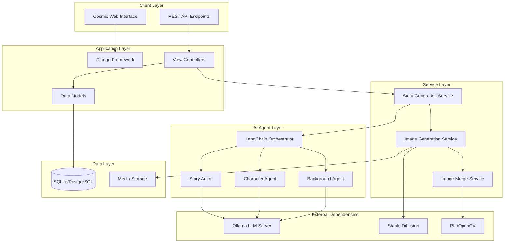
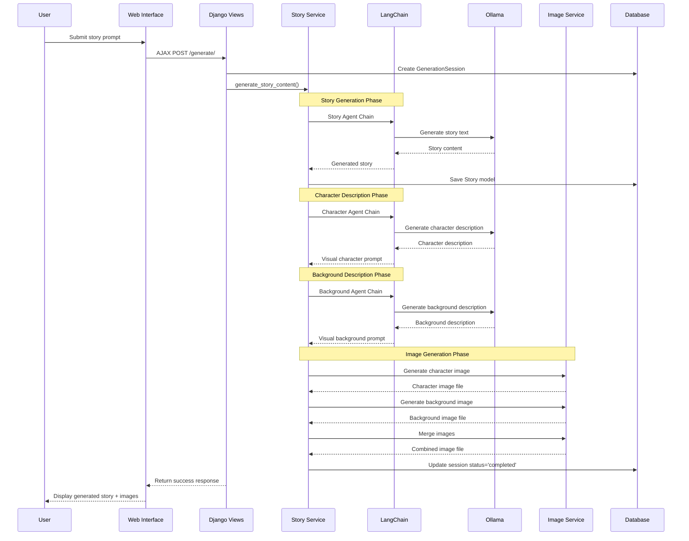

# 🏗️ System Architecture Documentation

## Overview

Story Agent implements a sophisticated multi-agent architecture using LangChain orchestration, Django web framework, and integrated AI pipelines for both text and image generation.

## High-Level Architecture



## Core Components

### 1. Django Web Framework

**Purpose**: Web application foundation and request handling
**Location**: `story_generator/` directory
**Key Files**:
- `settings.py`: Configuration and environment variables
- `urls.py`: URL routing and endpoint definitions
- `wsgi.py`: WSGI application for deployment

**Design Decisions**:
- Chosen for rapid development and robust ORM
- SQLite for development, PostgreSQL-ready for production
- Session-based progress tracking for long-running operations

### 2. LangChain Agent Orchestration

**Purpose**: Coordinate multiple AI agents with context preservation
**Location**: `stories/services.py`
**Architecture Pattern**: Sequential Agent Chaining

```python
class StoryGenerationService:
    def __init__(self):
        self.llm = OllamaLLM(
            base_url=settings.OLLAMA_BASE_URL,
            model=settings.OLLAMA_MODEL
        )
    
    def create_story_chain(self):
        return story_prompt | self.llm
    
    def create_character_description_chain(self):
        return character_prompt | self.llm
    
    def create_background_description_chain(self):
        return background_prompt | self.llm
```

**Design Rationale**:
- **RunnableSequence Pattern**: Modern LangChain approach replacing deprecated LLMChain
- **Context Preservation**: Story content passed between agents
- **Error Handling**: Each agent validates input/output
- **Modularity**: Agents can be easily modified or replaced

### 3. Data Model Architecture

**Location**: `stories/models.py`

```python
# Core Models
class Story(models.Model):
    title = models.CharField(max_length=200)
    prompt = models.TextField()
    story_text = models.TextField()
    character_description = models.TextField()
    background_description = models.TextField()
    created_at = models.DateTimeField(auto_now_add=True)
    
    # Convenience Properties
    @property
    def first_image(self):
        return self.images.first()
    
    @property
    def combined_image(self):
        return self.images.filter(image_type='combined').first()

class GeneratedImage(models.Model):
    story = models.ForeignKey(Story, related_name='images')
    image_type = models.CharField(max_length=20, choices=[
        ('character', 'Character'),
        ('background', 'Background'), 
        ('combined', 'Combined')
    ])
    image_file = models.ImageField(upload_to='generated_images/')
    prompt_used = models.TextField()

class GenerationSession(models.Model):
    session_id = models.CharField(max_length=100, unique=True)
    status = models.CharField(max_length=20, choices=[
        ('pending', 'Pending'),
        ('generating_story', 'Generating Story'),
        ('generating_images', 'Generating Images'),
        ('completed', 'Completed'),
        ('failed', 'Failed')
    ])
    progress_percentage = models.IntegerField(default=0)
    story = models.OneToOneField(Story, null=True, blank=True)
```

**Design Principles**:
- **Single Responsibility**: Each model handles specific data
- **Relationship Mapping**: Foreign keys maintain data integrity
- **Progress Tracking**: Session model enables real-time updates
- **Extensibility**: Easy to add new image types or metadata

### 4. Image Generation Pipeline

**Architecture**: Multi-stage visual content creation

```python
class ImageGenerationService:
    def __init__(self):
        from diffusers import StableDiffusionPipeline
        import torch
        
        self.device = "cuda" if torch.cuda.is_available() else "cpu"
        self.pipe = StableDiffusionPipeline.from_pretrained(
            "runwayml/stable-diffusion-v1-5",
            torch_dtype=torch.float16 if self.device == "cuda" else torch.float32
        ).to(self.device)
    
    def generate_image(self, prompt, filename):
        image = self.pipe(
            prompt,
            num_inference_steps=20,
            height=512, 
            width=512
        ).images[0]
        
        image.save(filename)
        return filename

class ImageMergeService:
    @staticmethod
    def merge_images(character_path, background_path, output_path):
        from PIL import Image
        import numpy as np
        
        character_img = Image.open(character_path).convert("RGBA")
        background_img = Image.open(background_path).convert("RGB")
        
        # Intelligent compositing logic
        target_size = settings.IMAGE_MERGE_SIZE
        character_img = character_img.resize((target_size[0]//2, target_size[1]))
        background_img = background_img.resize(target_size)
        
        combined = Image.new("RGB", target_size)
        combined.paste(background_img, (0, 0))
        combined.paste(character_img, (target_size[0]//2, 0), character_img)
        
        combined.save(output_path)
        return output_path
```

**Pipeline Stages**:
1. **Text-to-Image**: Stable Diffusion generates character and background
2. **Image Processing**: PIL handles resizing and format conversion
3. **Intelligent Merging**: Composite character over background
4. **Storage**: Save final images to media directory

## Request Flow Architecture

### Story Generation Request Flow



### Progress Tracking Architecture

**Real-time Updates**: AJAX polling system

```javascript
function pollGenerationStatus(sessionId) {
    const statusInterval = setInterval(function() {
        $.ajax({
            url: `/status/${sessionId}/`,
            method: 'GET',
            success: function(response) {
                updateProgress(response.progress, response.status);
                
                if (response.status === 'completed') {
                    clearInterval(statusInterval);
                    window.location.href = `/story/${response.story_id}/`;
                }
            }
        });
    }, 2000);
}
```

**Backend Progress Updates**:
```python
def generate_story_content(session, user_prompt):
    # Phase 1: Story Generation (10-30%)
    session.status = 'generating_story'
    session.progress_percentage = 10
    session.save()
    
    story_text = story_service.generate_story(user_prompt)
    session.progress_percentage = 30
    session.save()
    
    # Phase 2: Image Generation (30-90%)
    session.status = 'generating_images'
    session.progress_percentage = 50
    session.save()
    
    # Generate images...
    session.progress_percentage = 90
    session.save()
    
    # Phase 3: Completion (100%)
    session.status = 'completed'
    session.progress_percentage = 100
    session.save()
```

## Scalability Considerations

### Current Architecture Strengths
- ✅ **Modular Design**: Components can be independently scaled
- ✅ **Database Optimization**: Efficient queries with select_related()
- ✅ **Static File Handling**: Media files served efficiently
- ✅ **Session Management**: Tracks long-running operations

### Production Scaling Recommendations

1. **Database Layer**
   - Migrate to PostgreSQL for better concurrency
   - Implement connection pooling
   - Add database indexing for frequently queried fields

2. **Application Layer** 
   - Deploy with Gunicorn/uWSGI WSGI servers
   - Implement Redis for session storage and caching
   - Add Celery for background task processing

3. **AI Service Layer**
   - Implement GPU server pooling for image generation
   - Add model caching to reduce loading time
   - Consider API-based LLM services for scaling

4. **Infrastructure**
   - Containerize with Docker for consistent deployment
   - Use load balancing for high availability
   - Implement CDN for static/media file serving

## Security Architecture

### Input Validation
- **Prompt Sanitization**: Prevent injection attacks
- **File Upload Validation**: Secure media handling
- **Session Security**: UUID-based session tracking

### Data Protection
- **Database Security**: ORM prevents SQL injection
- **Media Security**: Restricted file upload paths
- **Environment Variables**: Sensitive config externalized

## Error Handling Strategy

### Multi-layer Error Handling

```python
def generate_story_content(session, user_prompt):
    try:
        # Generation logic
        story_text = story_service.generate_story(user_prompt)
        
    except OllamaConnectionError:
        session.status = 'failed'
        session.error_message = 'LLM service unavailable'
        session.save()
        
    except ImageGenerationError:
        session.status = 'failed' 
        session.error_message = 'Image generation failed'
        session.save()
        
    except Exception as e:
        session.status = 'failed'
        session.error_message = str(e)
        session.save()
        logger.error(f"Generation failed: {e}")
```

### Graceful Degradation
- **LLM Unavailable**: Return text-only story
- **Image Generation Failed**: Show story without images  
- **Partial Success**: Display available content with error notes

---

*This architecture documentation reflects current implementation and planned enhancements for production deployment.*