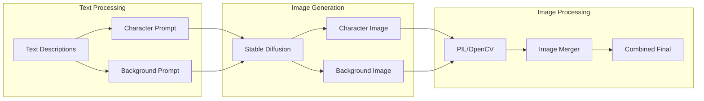

# 🎨 Image Generation Pipeline Documentation

## Overview

The Story Agent image generation pipeline transforms textual descriptions into high-quality visual content using Stable Diffusion models, with intelligent image composition and merging capabilities.

## Pipeline Architecture



## Core Components

### 1. Stable Diffusion Integration

**Model Configuration:**
```python
from diffusers import StableDiffusionPipeline
import torch

class ImageGenerationService:
    def __init__(self):
        self.device = "cuda" if torch.cuda.is_available() else "cpu"
        self.pipe = StableDiffusionPipeline.from_pretrained(
            "runwayml/stable-diffusion-v1-5",
            torch_dtype=torch.float16 if self.device == "cuda" else torch.float32,
            safety_checker=None,
            requires_safety_checker=False
        ).to(self.device)
        
        # Optimization for better performance
        if self.device == "cuda":
            self.pipe.enable_attention_slicing()
            self.pipe.enable_xformers_memory_efficient_attention()
```

**Supported Models:**
- **runwayml/stable-diffusion-v1-5**: General purpose, well-balanced
- **stabilityai/stable-diffusion-2-1**: Improved quality and detail
- **stabilityai/stable-diffusion-xl-base-1.0**: Higher resolution output
- **Custom Fine-tuned Models**: Domain-specific adaptations

### 2. Generation Parameters

**Character Image Generation:**
```python
def generate_character_image(self, prompt, output_path):
    """Generate character-focused image with portrait orientation"""
    
    # Optimized parameters for character generation
    generation_params = {
        "prompt": prompt,
        "negative_prompt": "blurry, low quality, distorted, extra limbs, bad anatomy",
        "num_inference_steps": 25,
        "guidance_scale": 7.5,
        "height": 512,
        "width": 384,  # Portrait aspect ratio
        "num_images_per_prompt": 1,
        "generator": torch.Generator(device=self.device).manual_seed(42)
    }
    
    image = self.pipe(**generation_params).images[0]
    image.save(output_path, quality=95)
    return output_path
```

**Background Image Generation:**
```python
def generate_background_image(self, prompt, output_path):
    """Generate environment-focused image with landscape orientation"""
    
    generation_params = {
        "prompt": f"beautiful detailed {prompt}, concept art, trending on artstation",
        "negative_prompt": "people, characters, faces, low quality, blurry",
        "num_inference_steps": 20,
        "guidance_scale": 6.0,
        "height": 384,
        "width": 512,  # Landscape aspect ratio
        "num_images_per_prompt": 1,
        "generator": torch.Generator(device=self.device).manual_seed(123)
    }
    
    image = self.pipe(**generation_params).images[0]
    image.save(output_path, quality=95)
    return output_path
```

### 3. Image Composition and Merging

**Intelligent Image Merger:**
```python
from PIL import Image, ImageFilter, ImageEnhance
import numpy as np

class ImageMergeService:
    @staticmethod
    def merge_images(character_path, background_path, output_path):
        """Intelligently compose character and background images"""
        
        # Load and prepare images
        character_img = Image.open(character_path).convert("RGBA")
        background_img = Image.open(background_path).convert("RGB")
        
        # Target dimensions for final composite
        target_width, target_height = 1024, 512
        
        # Resize background to fill target area
        background_resized = background_img.resize(
            (target_width, target_height), 
            Image.Resampling.LANCZOS
        )
        
        # Resize character to fit composition
        char_width = target_width // 2
        char_height = target_height
        character_resized = character_img.resize(
            (char_width, char_height), 
            Image.Resampling.LANCZOS
        )
        
        # Create final composition
        final_image = Image.new("RGB", (target_width, target_height))
        
        # Place background
        final_image.paste(background_resized, (0, 0))
        
        # Add character with alpha blending
        if character_resized.mode == 'RGBA':
            # Use alpha channel for natural blending
            final_image.paste(
                character_resized, 
                (target_width - char_width, 0), 
                character_resized
            )
        else:
            # Direct paste for opaque images
            final_image.paste(character_resized, (target_width - char_width, 0))
        
        # Apply subtle enhancement
        enhancer = ImageEnhance.Contrast(final_image)
        final_image = enhancer.enhance(1.1)
        
        # Save with high quality
        final_image.save(output_path, "JPEG", quality=95, optimize=True)
        return output_path
```

## Advanced Features

### 1. Prompt Engineering for Images

**Character Prompt Optimization:**
```python
def optimize_character_prompt(self, description):
    """Enhance character descriptions for better image generation"""
    
    # Add quality modifiers
    quality_terms = [
        "highly detailed", "professional digital art", 
        "intricate details", "sharp focus"
    ]
    
    # Add style guidance
    style_terms = [
        "fantasy art style", "concept art", 
        "detailed character design"
    ]
    
    # Combine with original description
    optimized = f"{description}, {', '.join(quality_terms)}, {', '.join(style_terms)}"
    
    return optimized

def optimize_background_prompt(self, description):
    """Enhance environment descriptions for atmospheric images"""
    
    atmosphere_terms = [
        "cinematic lighting", "detailed environment",
        "atmospheric perspective", "masterpiece"
    ]
    
    optimized = f"{description}, {', '.join(atmosphere_terms)}"
    return optimized
```

### 2. Model Performance Optimization

**Memory Management:**
```python
class OptimizedImageGeneration:
    def __init__(self):
        self.pipe = None
        self.model_path = "runwayml/stable-diffusion-v1-5"
        
    def load_model(self):
        """Lazy load model to save memory"""
        if self.pipe is None:
            self.pipe = StableDiffusionPipeline.from_pretrained(
                self.model_path,
                torch_dtype=torch.float16,
                use_safetensors=True
            ).to("cuda")
            
            # Memory optimizations
            self.pipe.enable_attention_slicing()
            self.pipe.enable_vae_slicing()
            
    def unload_model(self):
        """Free GPU memory when not in use"""
        if self.pipe is not None:
            del self.pipe
            torch.cuda.empty_cache()
            self.pipe = None
```

**Batch Processing:**
```python
def generate_multiple_images(self, prompts, output_dir):
    """Generate multiple images efficiently"""
    
    # Load model once
    self.load_model()
    
    results = []
    for i, prompt in enumerate(prompts):
        output_path = f"{output_dir}/image_{i:03d}.jpg"
        
        # Generate with consistent parameters
        image = self.pipe(
            prompt,
            num_inference_steps=20,
            guidance_scale=7.0,
            generator=torch.Generator().manual_seed(i)
        ).images[0]
        
        image.save(output_path)
        results.append(output_path)
        
        # Clear memory periodically
        if i % 10 == 0:
            torch.cuda.empty_cache()
    
    return results
```

### 3. Quality Enhancement Pipeline

**Post-Processing Enhancement:**
```python
from PIL import ImageEnhance, ImageFilter

class ImageEnhancer:
    @staticmethod
    def enhance_image(image_path, output_path):
        """Apply post-processing enhancements"""
        
        image = Image.open(image_path)
        
        # Enhance sharpness
        sharpness_enhancer = ImageEnhance.Sharpness(image)
        image = sharpness_enhancer.enhance(1.2)
        
        # Enhance contrast slightly
        contrast_enhancer = ImageEnhance.Contrast(image)
        image = contrast_enhancer.enhance(1.1)
        
        # Enhance color saturation
        color_enhancer = ImageEnhance.Color(image)
        image = color_enhancer.enhance(1.1)
        
        # Apply subtle unsharp mask
        image = image.filter(ImageFilter.UnsharpMask(radius=1, percent=150, threshold=3))
        
        image.save(output_path, quality=95, optimize=True)
        return output_path
```

### 4. Error Handling and Fallbacks

**Robust Generation Pipeline:**
```python
def generate_with_fallback(self, prompt, output_path, max_attempts=3):
    """Generate image with fallback strategies"""
    
    for attempt in range(max_attempts):
        try:
            # Primary generation attempt
            image = self.pipe(
                prompt,
                num_inference_steps=25,
                guidance_scale=7.5
            ).images[0]
            
            # Validate image quality
            if self.validate_image_quality(image):
                image.save(output_path)
                return output_path
                
        except torch.cuda.OutOfMemoryError:
            # Reduce parameters for memory constraints
            torch.cuda.empty_cache()
            image = self.pipe(
                prompt,
                num_inference_steps=15,  # Reduced steps
                guidance_scale=6.0,      # Lower guidance
                height=384,              # Smaller resolution
                width=384
            ).images[0]
            
        except Exception as e:
            logger.warning(f"Generation attempt {attempt + 1} failed: {e}")
            if attempt == max_attempts - 1:
                # Return placeholder image on final failure
                return self.create_placeholder_image(output_path)
            
    return None

def validate_image_quality(self, image):
    """Basic image quality validation"""
    # Convert to numpy for analysis
    img_array = np.array(image)
    
    # Check for completely black or white images
    if img_array.mean() < 10 or img_array.mean() > 245:
        return False
        
    # Check for reasonable variance (not completely uniform)
    if img_array.std() < 5:
        return False
        
    return True
```

## Model Licensing and Attribution

### Supported Models and Licenses

| Model | License | Attribution | Commercial Use |
|-------|---------|-------------|----------------|
| **Stable Diffusion v1.5** | CreativeML Open RAIL-M | Stability AI | ✅ With restrictions |
| **Stable Diffusion v2.1** | CreativeML Open RAIL++ | Stability AI | ✅ With restrictions |
| **Stable Diffusion XL** | CreativeML Open RAIL++ | Stability AI | ✅ With restrictions |

### License Compliance

**Required Attribution:**
```python
# Model attribution in generated content
ATTRIBUTION_TEXT = """
Generated using Stable Diffusion model by Stability AI
Licensed under CreativeML Open RAIL License
https://github.com/Stability-AI/stablediffusion
"""

def add_attribution(self, image_path):
    """Add attribution watermark to generated images"""
    from PIL import ImageDraw, ImageFont
    
    image = Image.open(image_path)
    draw = ImageDraw.Draw(image)
    
    # Add small attribution text
    font_size = max(12, min(image.width, image.height) // 40)
    try:
        font = ImageFont.truetype("arial.ttf", font_size)
    except:
        font = ImageFont.load_default()
    
    text = "Generated with Stable Diffusion"
    text_bbox = draw.textbbox((0, 0), text, font=font)
    text_width = text_bbox[2] - text_bbox[0]
    
    # Position at bottom right
    x = image.width - text_width - 10
    y = image.height - font_size - 10
    
    # Add semi-transparent background
    draw.rectangle([x-5, y-2, x+text_width+5, y+font_size+2], 
                   fill=(0, 0, 0, 128))
    draw.text((x, y), text, fill=(255, 255, 255, 200), font=font)
    
    image.save(image_path)
```

## Performance Benchmarks

### Generation Times (NVIDIA RTX 4090)

| Image Type | Resolution | Steps | Time (seconds) |
|------------|------------|-------|----------------|
| Character | 384x512 | 25 | 3-5 |
| Background | 512x384 | 20 | 2-4 |
| Combined | 1024x512 | N/A | 1-2 |
| **Total** | - | - | **6-11** |

### Memory Requirements

| Configuration | VRAM Usage | System RAM |
|---------------|------------|------------|
| SD v1.5 (FP16) | 4-6 GB | 8 GB |
| SD v2.1 (FP16) | 5-7 GB | 10 GB |
| SD XL (FP16) | 8-10 GB | 16 GB |

## Configuration Options

### Environment Variables
```bash
# GPU Configuration
CUDA_VISIBLE_DEVICES=0
PYTORCH_CUDA_ALLOC_CONF=max_split_size_mb:512

# Model Configuration  
DIFFUSION_MODEL=runwayml/stable-diffusion-v1-5
USE_XFORMERS=true
ATTENTION_SLICING=true

# Generation Settings
DEFAULT_STEPS=20
DEFAULT_GUIDANCE=7.5
MAX_IMAGE_SIZE=1024
```

### Django Settings Integration
```python
# settings.py
STABLE_DIFFUSION_CONFIG = {
    'model_id': 'runwayml/stable-diffusion-v1-5',
    'device': 'cuda' if torch.cuda.is_available() else 'cpu',
    'torch_dtype': torch.float16,
    'enable_attention_slicing': True,
    'enable_xformers': True,
    'safety_checker': None,
    'default_steps': 20,
    'default_guidance': 7.5,
    'max_resolution': (1024, 1024),
}

IMAGE_MERGE_CONFIG = {
    'target_size': (1024, 512),
    'quality': 95,
    'character_position': 'right',
    'blend_mode': 'alpha',
}
```

## Troubleshooting Guide

### Common Issues and Solutions

**1. CUDA Out of Memory:**
```python
# Reduce batch size
# Enable attention slicing
self.pipe.enable_attention_slicing()

# Use CPU offload
self.pipe.enable_sequential_cpu_offload()

# Reduce image resolution
height, width = 384, 384  # Instead of 512, 512
```

**2. Poor Image Quality:**
```python
# Increase inference steps
num_inference_steps = 30  # Instead of 20

# Adjust guidance scale
guidance_scale = 8.5  # Higher for more prompt adherence

# Use negative prompts
negative_prompt = "blurry, low quality, distorted, bad anatomy"
```

**3. Slow Generation:**
```python
# Enable optimizations
self.pipe.enable_xformers_memory_efficient_attention()
self.pipe.enable_attention_slicing()

# Use TensorRT optimization (advanced)
self.pipe.unet = torch.jit.script(self.pipe.unet)
```

---

*This documentation covers the complete image generation pipeline used in Story Agent for creating high-quality visual content from textual descriptions.*